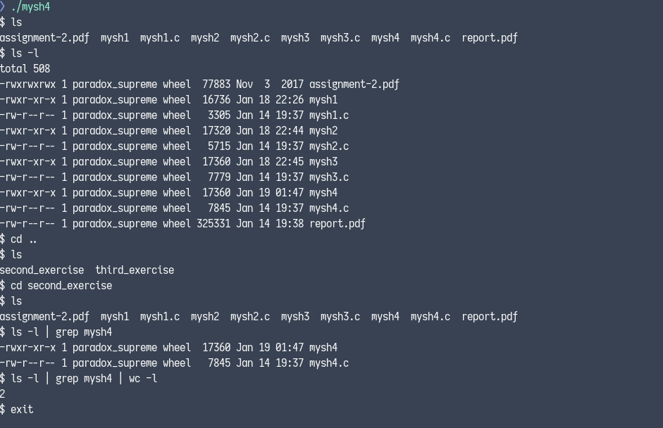
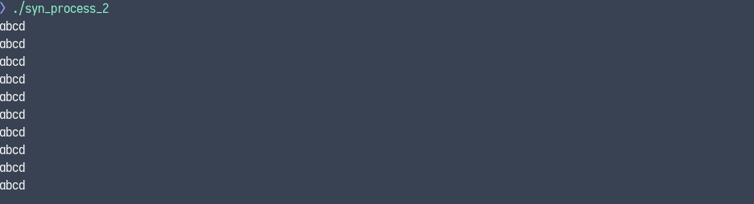

# Operating Systems 2016
This repository contains two course assignments for the **Operating Systems** university course for the
academic period of 2016-2017 done by <a href="https://github.com/PARVD0XSVPR3ME">Panagiotis Charalampopoulos</a>.

## Assignment 1
Developed a minimal shell in C that has the following features:
- It reads the name of a program from the keyboard and if the program exists in any directory inside the
`$PATH` variable, it executes it.
- It supports multiple parameters
- It provides an `exit` and a `cd` command that supports both absolute and relative paths as arguments.
- It supports multiple pipes using the `|` character.


### Compilation Instructions

```bash
gcc -o mysh4 mysh4.c
```

### Usage

```bash
./mysh4
```



## Assignment 2
Performed **process synchronization** using **semaphores** and also **thread synchronization** using pthreads
API's **mutexes** and **condition variables** in C in order to avoid **race conditions** when two or more
**processes** or **threads** are using the same resource respectively.

### Compilation Instructions

```bash
gcc syn_process_1.c display.c -o syn_process_1
gcc syn_process_2.c display.c -o syn_process_2
gcc -pthread syn_thread_1.c display.c -o syn_thread_1
gcc -pthread syn_thread_2.c display.c -o syn_thread_2
```

### Usage

```bash
./syn_process_1
./syn_process_2
./syn_thread_1
./syn_thread_2
```





# License
All files except `assignment-2.pdf` and `assignment-3.pdf` are licensed under the
[AGPL-3.0](https://www.gnu.org/licenses/agpl-3.0.en.html) license.

Copyright © <a href="https://github.com/PARVD0XSVPR3ME">Panagiotis Charalampopoulos</a>
